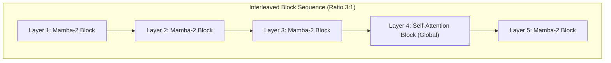

# 3B Parameter Model Design Specification: 2026 SOTA Architectures

This specification details the optimal architecture configurations for a **3B parameter class model** based on the latest **2026 state-of-the-art (SOTA)** paradigms. 

In 2026, the definition of a "3B model" has evolved. Rather than building simple dense models, modern architectures leverage **conditional scaling (Mixture of Experts)** and **hybrid SSM-Transformers** to achieve the intelligence of models 10x their size while keeping the execution computational cost strictly at the 3B level.

Below are the two leading architectures to choose from depending on whether your 3B constraint is **strictly on active parameters (computational budget)** or **strictly on total parameters (disk/RAM footprint)**.

---

## Option A: Sparse Mixture-of-Experts (MoE) 
*Recommended if your constraint is **3B Active Parameters** (computational execution budget).*

This design aligns with 2026 SOTA architectures like **Qwen3-30B-A3B** and **Nemotron-3-Nano (30B-A3B)**. By utilizing a sparse Mixture of Experts, the model achieves the factual knowledge storage of a 30B model while executing only 3B parameters per token during the forward pass.

### MoE Architectural Hyperparameters

| Hyperparameter | Value | Rationale |
| :--- | :--- | :--- |
| **Total Parameters** | **~30 Billion** | Huge capacity for factual recall and multilingual task accuracy. |
| **Active Parameters** | **3.0 Billion** | Strictly limits execution cost per token to a 3B model equivalent. |
| **Layers ($L$)** | **36** | High depth for abstract reasoning. |
| **Hidden Size ($H$)** | **2048** | Optimal base width for 3B active calculation. |
| **Attention Mechanism** | **Grouped-Query Attention (GQA)** | 16 Query Heads / 8 Key-Value Heads. GQA is preferred here because MoE routing overhead dominates the execution loop. |
| **Total Experts ($E_{total}$)** | **32** | Fine-grained expert routing allows specialized knowledge compartments. |
| **Active Experts ($E_{active}$)** | **Top-2** | Selects the two most relevant experts per token. |
| **Shared Experts** | **2** | DeepSeek V3/V4 style shared experts are always active to capture general representations, reducing expert redundancy. |
| **FFN Expansion** | **SwiGLU** | Gated Linear Unit with Swish activation. |

---

## Option B: Hybrid SSM-Transformer (Mamba + Attention)
*Recommended if your constraint is **3B Total Parameters** (strict disk space / RAM footprint).*

This design aligns with the 2026 **Mamba-Transformer hybrid** SOTA (e.g., *Nemotron 3 Super / Nano* family). Instead of using self-attention for every layer, it interleaves linear-time State Space Model (SSM) layers (Mamba-2) with global Self-Attention layers.



### Hybrid Architectural Hyperparameters

| Hyperparameter | Value | Rationale |
| :--- | :--- | :--- |
| **Total Parameters** | **3.2 Billion** | Fits strictly in a 3B hardware envelope. |
| **Layers ($L$)** | **36** | Deep architecture. |
| **Block Interleaving Ratio** | **3:1** | Three Mamba-2 layers followed by one Global Self-Attention layer. |
| **Mamba Layer (SSM)** | **Mamba-2** | State Space Model handles linear-time context routing. Excellent for extremely long contexts (up to 128k) and sequential processing. |
| **Attention Layer** | **Multi-Head Attention (MHA)** | 16 Query / 16 KV heads. Since attention is only run on 25% of the layers, we do not compress it with GQA—MHA retains maximum quality. |
| **Hidden Size ($H$)** | **2048** | Base hidden width. |
| **FFN Intermediate Size ($I$)** | **11008** | Expanded FFN intermediate size in the attention layers to maximize knowledge storage. |
| **Positional Encoding** | **NoPE + RoPE** | No Positional Encoding (NoPE) in Mamba layers (recurrence naturally tracks sequence order). Standard RoPE in the Attention layers. |

---

## SOTA Features to Include in Both Designs

Regardless of the option chosen, integrate these recent 2025/2026 SOTA optimizations:

### 1. Multi-Token Prediction (MTP)
Popularized by DeepSeek V3/V4 and supported by Megatron-LM natively (refer to the [MTP Block](file:///C:/Users/surya/Documents/antigravity/cool-babbage/Megatron-LM/megatron/core/transformer/multi_token_prediction.py)), include **1 or 2 MTP heads**. 
*   **Why**: Instead of predicting only token $t+1$, the model additionally predicts $t+2$ in parallel during training. This improves sample efficiency, reinforces planning capability, and makes the backbone representations significantly higher quality.

### 2. Zero-Centered RMSNorm
Gemma 3 style normalization layers with zero-centered weight parameters.
*   **Why**: Zero-centering prevents activation drift over very deep structures and long-context windows, stabilizing gradient flows.

### 3. High RoPE Theta Base
Scale `rope_theta` to **1,000,000**.
*   **Why**: Essential for maintaining performance up to 128K context length.

---

## Megatron Core 2026 Alignment

*   **For Option A (MoE)**: Utilize Megatron Core's optimized MoE module ([moe_layer.py](file:///C:/Users/surya/Documents/antigravity/cool-babbage/Megatron-LM/megatron/core/transformer/moe/moe_layer.py)) with Expert Parallelism (EP=8) and Sequence Parallelism (SP) enabled.
*   **For Option B (Hybrid)**: Utilize the modular [hybrid_builders.py](file:///C:/Users/surya/Documents/antigravity/cool-babbage/Megatron-LM/hybrid_builders.py) in the Megatron-LM repository, which supports building SSM-Transformer hybrid structures natively using Mamba blocks.
*   **MTP Support**: Enable `--mtp-num-layers=1` or configure it in the `ConfigContainer` when training through Megatron-Bridge.

---

## The 2 Trillion Token Constraint: Architectural Impact

A training budget of **2 Trillion tokens** significantly changes your architectural priorities:

### 1. Why Option B (Hybrid SSM-Transformer) is Superior to Option A (MoE) under 2T Tokens
*   **The Expert Under-Saturation Problem**: A 30B MoE model (Option A) has a massive total parameter count. Under a 2T token budget, the model-to-data ratio is only **66 tokens per parameter**. Because router selections split tokens among 32 experts, individual experts will not see enough tokens to converge fully. The experts will remain under-trained, leading to suboptimal quality.
*   **The Hybrid Saturation Edge**: A 3B dense/hybrid model (Option B) trained on 2T tokens achieves a **~625 tokens-per-parameter** ratio. This is deep in the overtraining zone. The model will be highly saturated, mathematically stable, and extract the maximum possible quality from every single parameter.

**Recommendation**: Under a strict 2T token limit, **Option B (Hybrid Mamba-Transformer)** or a pure **MHA Dense Model** is the winning architecture.

### 2. Maximizing Quality with Bidirectional Bridge (Distillation vs. From-Scratch)
If you are capped at 2T tokens, training a 3B model from scratch will yield a good model, but **it will not beat the frontier 3B models** (which are trained on 9T–18T tokens). 
To achieve the absolute highest quality:

1.  **Stage 1: Distillation**:
    Use your Hugging Face bidirectional pipeline to initialize a student model by distilling logits from a state-of-the-art 2026 teacher model (e.g. a Llama 4 or Qwen 3 large variant).
2.  **Stage 2: Continued Pretraining (Warm-Starting)**:
    Initialize your Megatron training from a pretrained 3B checkpoint using:
    ```python
    cfg.model = AutoBridge.from_hf_pretrained("Qwen/Qwen2.5-3B").to_megatron_provider(load_weights=True)
    ```
    Train this model on your 2T domain-specific tokens inside Megatron. This preserves the general knowledge learned from 18T tokens while specializing the model to your target data, producing a final model of much higher quality than a from-scratch run.

